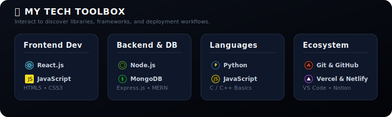

<!-- Premium GitHub Profile README by Lakshmipathy -->

  

  
  
  
  

---

## ⚡ Quick Pitch & Philosophy

Welcome to my digital workspace! I am a final-year BCA student and an aspiring full-stack developer dedicated to mastering the MERN stack and writing clean, scalable, and modular code.

> **"Every bug I fix is a lesson learned. Every feature I ship is a story told. I don't just build projects—I build possibilities."**

  
<b>📖 Explore My Developer Manifesto &amp; Goals (Click to Expand)</b>

   
  <ul>
    <li>🚀 <b>The Vision:</b> The goal isn’t just to write code—it’s to solve problems. I aim to build human-centric products that address real-world needs and simplify user workflows.</li>
    <li>🌱 <b>The Method:</b> <i>"I build. I break. I learn. I grow."</i> I embrace constraints, appreciate the debugging process, and consider continuous learning my core engine.</li>
    <li>🎯 <b>Current Target:</b> Refining full-stack integration, learning advanced coding design patterns, and preparing for professional engineering opportunities.</li>
  </ul>

 

  
<b>📚 What I'm Learning &amp; Up-skilling (Click to Expand)</b>

   
  <blockquote>"If the code doesn’t challenge you, it won’t change you."</blockquote>
  <ul>
    <li>🔥 <b>Deep JavaScript:</b> Rebuilding my foundational understanding from the ground up, learning closures, event loops, and asynchronous patterns.</li>
    <li>⚙️ <b>Advanced Full-Stack:</b> Mastering MERN integration, state management, database schema design, and secure routing.</li>
    <li>🐍 <b>Python Scripting:</b> Building utility scripts, data manipulation systems, and understanding algorithms.</li>
    <li>🧮 <b>Interviews &amp; Coding Patterns:</b> Solving algorithmic challenges, learning core structures, and optimizing complexity.</li>
    <li>📅 <b>Productivity:</b> Organizing and mapping my entire development journey and documentation inside Notion.</li>
  </ul>

---

## 📊 Git Analytics &amp; Insights

Here is a live look at my coding journey, language distribution, and activity on GitHub, customized to match my workspace theme.

  
  

  

---

## 🛠️ My Tech Toolbox

  

---

## 🚀 Featured Projects

Here is a selection of my key projects demonstrating frontend visuals, full-stack architectures, and clean database integrations.

### 🎭 [Strangers – Cultural Festival](https://github.com/Lakshmipathy-r/Strangers-demo)
* **Technologies:**    
* **Highlights:** Handles 32 distinct cultural events, smooth registration workflows, and optimized layouts.

  
<b>🔍 View Project Details &amp; Screenshots</b>

   
  <ul>
    <li><b>Live Demo:</b> <a href="https://strangers-testing.netlify.app/">strangers-testing.netlify.app</a></li>
    <li><b>Key Features:</b> Full responsive grids for mobile/tablet viewing, micro-interactions on hover cards, and interactive event information.</li>
  </ul>
  

    
  

 

### 📋 [Project Management Tool (MERN)](https://github.com/Lakshmipathy-r/Project-Management-Tool)
* **Technologies:**      
* **Highlights:** Secure authentication, dashboard visualization, status board tracking, and user profile management.

  
<b>🔍 View Project Details &amp; Screenshots</b>

   
  <ul>
    <li><b>Codebase:</b> <a href="https://github.com/Lakshmipathy-r/Project-Management-Tool">Repository</a></li>
    <li><b>Key Features:</b> User dashboard with metrics, responsive interface using Tailwind CSS, robust authentication middleware, and database schemas with relational references.</li>
  </ul>
  

    
  

 

### 🔐 [Login Page](https://github.com/Lakshmipathy-r/Login-page)
* **Technologies:**     
* **Highlights:** Clean CSS styling, interactive UI transitions, client-side/server-side validations.

  
<b>🔍 View Project Details</b>

   
  <ul>
    <li><b>Codebase:</b> <a href="https://github.com/Lakshmipathy-r/Login-page">Repository</a></li>
    <li><b>Highlights:</b> Serves as a modular login template for quick integration into full-stack templates. Supports session control and smooth field validations.</li>
  </ul>

 

### 🧑‍💼 [Personal Portfolio](https://github.com/Lakshmipathy-r/Portfolio)
* **Technologies:**    
* **Highlights:** Responsive layouts, modern typography, portfolio grid.

  
<b>🔍 View Project Details</b>

   
  <ul>
    <li><b>Live Portfolio:</b> <a href="https://lakshmipathy-r.github.io/Portfolio/">lakshmipathy-r.github.io/Portfolio</a></li>
    <li><b>Codebase:</b> <a href="https://github.com/Lakshmipathy-r/Portfolio">Repository</a></li>
  </ul>

---

## 🌐 Let's Connect

> **"Collaboration is the heartbeat of innovation."**

If you want to collaborate on a project, discuss full-stack development patterns, or share coding resources, feel free to reach out!

* 💼 **LinkedIn:** [linkedin.com/in/lakshmipathy-r-](https://www.linkedin.com/in/lakshmipathy-r-)
* 🌐 **Portfolio:** [lakshmipathy-r.github.io/Portfolio/](https://lakshmipathy-r.github.io/Portfolio/)
* 📧 **Email:** [lakshmipathyr2k6@gmail.com](mailto:lakshmipathyr2k6@gmail.com)
* 🐙 **GitHub:** [@Lakshmipathy-r](https://github.com/Lakshmipathy-r)

  Let's turn ambition into action, one commit at a time. Thanks for visiting! ⚡

